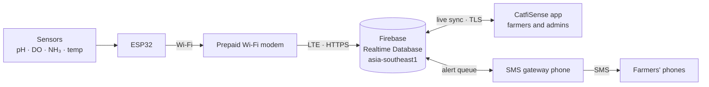

<<<<<<< HEAD
# CatfiSense

Water-quality monitoring for catfish ponds. An ESP32 sensor node measures **pH, dissolved oxygen (DO), ammonia and temperature** every 5 seconds and sends the readings to Firebase. This Android app lets pond owners and caretakers watch their pond live, get alerts, and keep a logbook. Admins monitor every pond, device and user from the same app.

CatfiSense is our capstone project, and has three parts:

| Part | What it does |
|---|---|
| **This app** (Flutter, Android) | Dashboards, alerts, history, logbook, maintenance and reports for farmers, plus the admin area |
| **ESP32 firmware** (PlatformIO, Arduino) | Reads the sensors, uploads a reading every 5 s, and queues SMS alerts |
| **SMS gateway** (Flutter, Android) | Runs on a phone with a SIM and texts queued alerts to the pond's alert numbers |

## How it works



1. The ESP32 writes each reading to `readings/<deviceId>/<epoch ms>`. The key is the device's send time, and Firebase adds its own `recordedAt` time, so the app can measure how long each upload took.
2. When a reading leaves the safe range, the ESP32 adds an alert to `smsQueue/<deviceId>`. The gateway phone picks it up and texts every number on the pond's alert list.
3. The app reads the same database live. Farmers see their own pond; admins see everything.

The data model and access rules are described in [docs/firebase-pond-data-model.md](docs/firebase-pond-data-model.md).

## Features

### For pond owners and caretakers
- **Live dashboard:** the latest readings with a status for each (Good, Warning, Critical) and a combined pond health index, plus banners when the sensor goes offline or the phone has no internet.
- **History:** charts for 24 hours, 7 days, 30 days or a custom range, with logbook entries marked on the chart. **Alert History** works out when each problem started and how long it lasted.
- **Insights:** what to do about each out-of-range reading, ranked by urgency.
- **Logbook:** record feeding, water changes, aerator use and treatments.
- **Maintenance reminders:** DO electrolyte, pH buffer and calibration, Wi-Fi modem load, and SMS gateway load. Each task has its own interval and sends phone notifications before it's due.
- **Reports:** export any period as PDF or CSV and share it.
- **Pond codes:** the owner shares the pond's join code, a caretaker signs up with it, and the owner can remove the caretaker or change the code at any time.
- **Alert numbers:** owners choose which phone numbers get SMS alerts, with no firmware change needed.
- **English and Filipino**, dark mode and adjustable text size.

### For admins
Admins log in with a username and get a separate area:
- **Health:** each device's upload speed (latest, average and slowest delay over the last hour), missed readings, gaps, battery, and whether the SMS gateway phone is online.
- **Ponds:** search ponds by name, ID, code or phone number. For each pond you can:
  - see the live sensor readings
  - add a pond from a device ID
  - rename the pond, name or remove members, and change the join code
  - manage the maintenance schedule and the SMS alert numbers
- **Users:** every admin and farmer account, with their pond and role.
- **Ranges:** edit the healthy and warning ranges for each reading. Every phone uses the new ranges immediately.
- **Audit log:** a permanent record of who changed what and when.

## Security

The Firebase API key in this repo is public by design. Access is enforced by the [Realtime Database rules](database.rules.json), not by hiding the key:

- **Signed-in users only:** every read and write needs a Firebase Auth login. Farmers sign in with their phone number and a password, and admins with a username.
- **Pond members only:** a member can read only their own pond's readings and data.
- **Pond codes:** a code can never add more than one owner and one caretaker. The owner and caretaker slots are single-use and enforced by the rules.
- **Admins:** the admin list can't be changed from the app; admins are added with the Firebase CLI.
- **Devices:** a device can only add new readings under its own ID, and existing readings can't be changed.
- **Audit log:** entries can only be added, never edited or deleted, and must carry the current server time.
- **Data checks:** names, phone numbers, ranges and intervals are validated by the rules, not just by the app.
- **SMS:** the gateway texts only the numbers saved for that pond.

The rules are tested against the Firebase Emulator with checks for each case, allowed and refused.

## Project structure

```
lib/
  pages/          Screens; admin/ holds the admin area
  services/       Firebase access: auth, ponds, readings, logbook, maintenance, audit, reports
  utils/          Pure logic: pond status, health index, alerts, thresholds, maintenance dates
  widgets/        Shared UI pieces
  l10n/           English and Filipino strings (app_en.arb, app_fil.arb)
  theme/          Colors and light/dark themes
docs/             Data model and security rules notes
database.rules.json   Realtime Database security rules
```

## Team

Belicena · Barquillo · Barredo · Abiera · Torreverde · Piosca
=======
